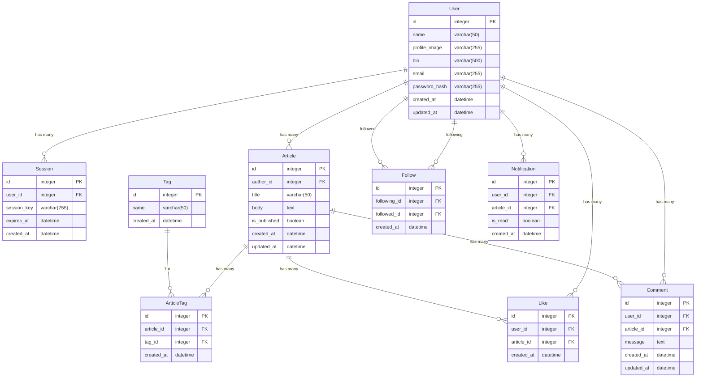

# DB設計

## ER図

## インデックス・制約

### ArticleTag
- UNIQUE INDEX: `(article_id, tag_id)`
- INDEX: `(user_id)`

### Like
- UNIQUE INDEX: `(user_id, article_id)`

### Follow
- UNIQUE INDEX: `(following_id, followed_id)`
