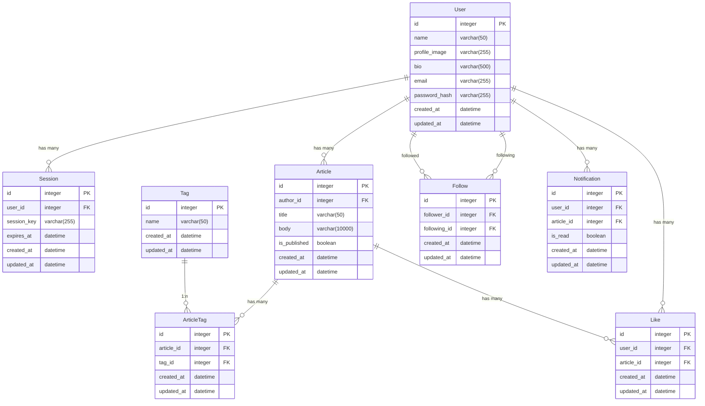

# DB設計

## ER図

## インデックス・制約

### User
- UNIQUE INDEX: `email`

### Tag
- UNIQUE INDEX: `name`

### ArticleTag
- UNIQUE INDEX: `(article_id, tag_id)`

### Like
- UNIQUE INDEX: `(user_id, article_id)`

### Follow
- UNIQUE INDEX: `(follower_id, following_id)`
