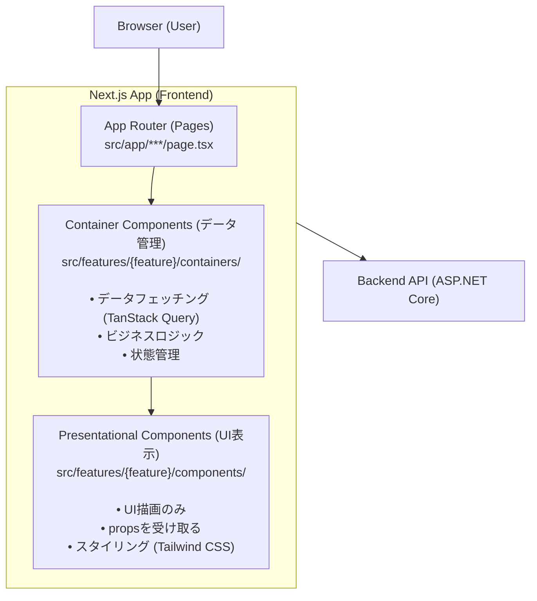
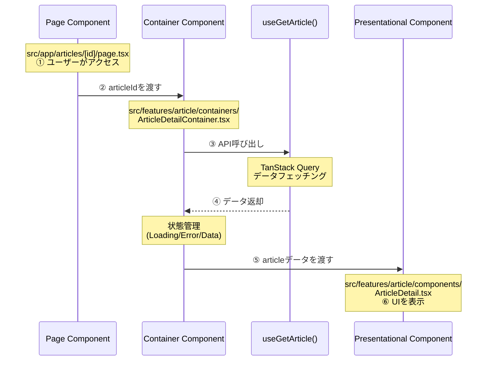
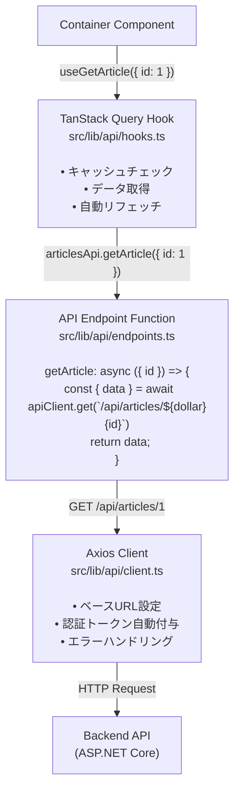
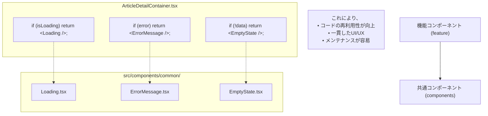
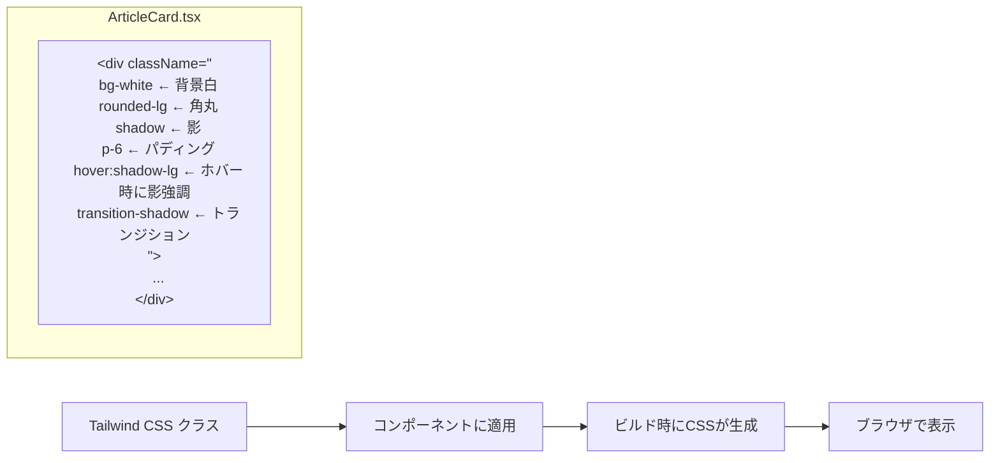
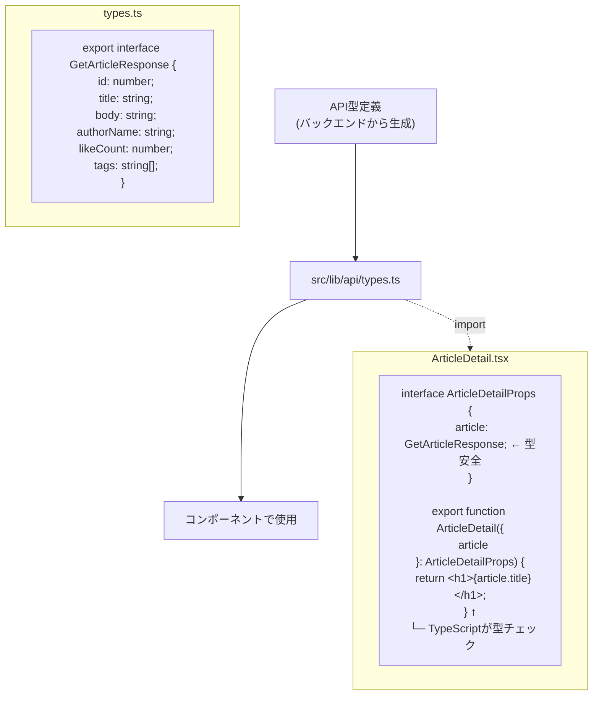

# フロントエンドアーキテクチャ図解

nari-note-frontendのアーキテクチャを図解で説明します。

**注意**: このドキュメントは古いContainer/Presentational構造を示しています。現在はAtomic Designパターン（Atoms → Molecules → Organisms）を採用しています。最新のアーキテクチャについては [frontend-architecture.md](./frontend-architecture.md) を参照してください。

## 全体構造



## ディレクトリ構造とデータフロー

```
src/
│
├── app/                              # 1️⃣ ユーザーがアクセス
│   ├── articles/
│   │   └── [id]/
│   │       └── page.tsx             # ArticleDetailPage
│   │           │
│   │           └─→ 2️⃣ Containerを呼び出し
│
├── features/                         # 機能モジュール
│   └── article/
│       │
│       ├── containers/               # 3️⃣ データ管理
│       │   └── ArticleDetailContainer.tsx
│       │       │
│       │       ├─→ useGetArticle()  # 4️⃣ API呼び出し
│       │       │   (TanStack Query)
│       │       │
│       │       └─→ 5️⃣ Presentationalに渡す
│       │
│       ├── components/               # 6️⃣ UI表示
│       │   └── ArticleDetail.tsx
│       │       └─→ 7️⃣ 画面に表示
│       │
│       └── hooks/                    # カスタムフック
│           └── useArticleForm.ts
│
├── components/                       # 共通コンポーネント
│   ├── ui/                          # Button, Input等
│   ├── layout/                      # Header, Footer等
│   └── common/                      # Loading, ErrorMessage等
│
└── lib/                             # 共通ロジック
    ├── api/                         # API関連
    │   ├── client.ts                # Axiosクライアント
    │   ├── hooks.ts                 # TanStack Query フック
    │   └── types.ts                 # 型定義
    ├── utils/                       # ユーティリティ関数
    ├── hooks/                       # 共通カスタムフック
    └── constants/                   # 定数定義
```

## Container/Presentationalパターン詳細

### データフロー



## API通信フロー



## 機能追加のフロー

### 新機能「コメント機能」を追加する例

```
Step 1: ディレクトリ作成
───────────────────────
src/features/comment/
├── components/
├── containers/
└── hooks/


Step 2: 型定義（必要に応じて）
─────────────────────────────
src/features/comment/types.ts


Step 3: Presentationalコンポーネント作成
──────────────────────────────────────
src/features/comment/components/
├── CommentList.tsx        # コメント一覧表示
├── CommentItem.tsx        # コメント1件表示
└── CommentForm.tsx        # コメント投稿フォーム


Step 4: Containerコンポーネント作成
──────────────────────────────────
src/features/comment/containers/
├── CommentListContainer.tsx
├── CommentItemContainer.tsx
└── CommentFormContainer.tsx


Step 5: カスタムフック作成（必要に応じて）
──────────────────────────────────────
src/features/comment/hooks/
└── useCommentForm.ts      # フォームロジック


Step 6: ページから使用
─────────────────────
src/app/articles/[id]/page.tsx

import { CommentListContainer } from '@/features/comment/containers/CommentListContainer';

export default function ArticleDetailPage() {
  return (
    <>
      <ArticleDetailContainer articleId={articleId} />
      <CommentListContainer articleId={articleId} />
    </>
  );
}
```

## 共通コンポーネントの活用



## スタイリングの流れ



## 型安全性の確保



## まとめ

### アーキテクチャの3つの柱

1. **明確な分離**
   - Container (データ) と Presentational (UI) の分離
   - 機能ごとのモジュール化 (features/)
   - 共通コンポーネントの再利用

2. **型安全性**
   - TypeScriptによる型チェック
   - APIレスポンスの型定義
   - propsの型定義

3. **保守性**
   - 一貫したディレクトリ構造
   - 明確な命名規則
   - 包括的なドキュメント

この構造により、開発者もAIも**どこに何を書けば良いかが明確**になります。

## 参考ドキュメント

- [フロントエンドアーキテクチャガイド](./frontend-architecture.md)
- [フロントエンド実装ガイド](./frontend-implementation-guide.md)
- [クイックリファレンス](./frontend-quick-reference.md)
