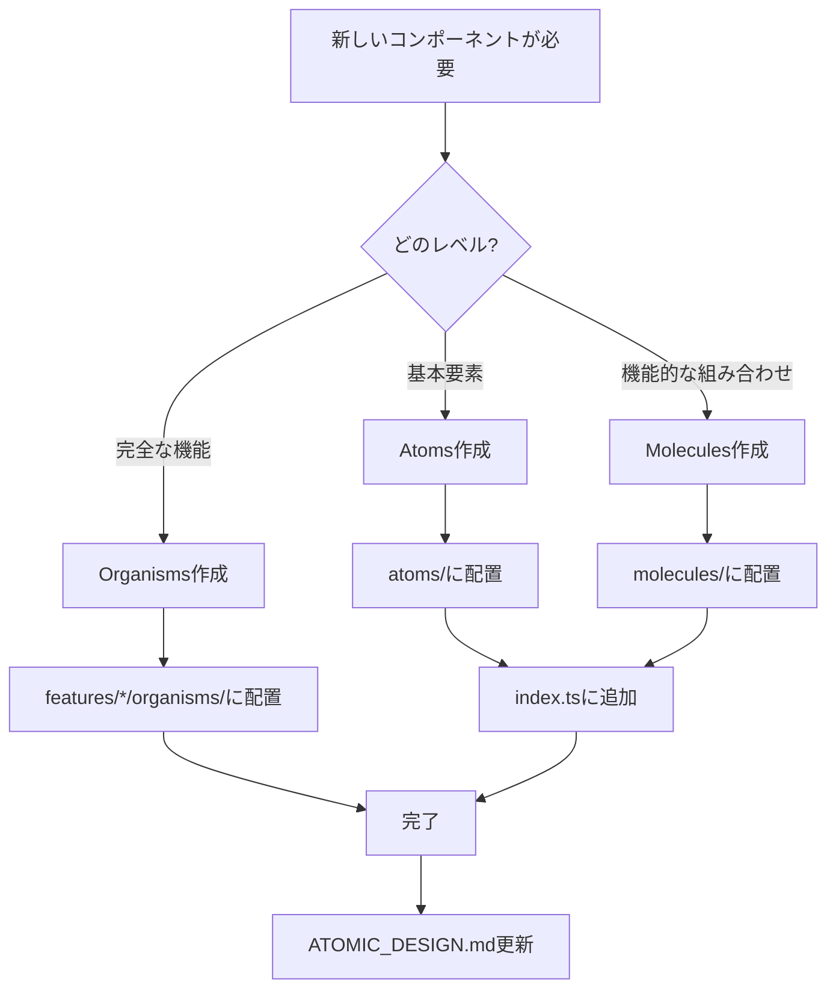

# Atomicデザインリファクタリング - ビジュアル概要

## Before: 不統一な構造

```
nari-note-frontend/src/
├── components/
│   ├── common/
│   │   ├── Loading.tsx                  ❌ 配置が不明確
│   │   ├── ErrorMessage.tsx             ❌ 配置が不明確
│   │   ├── EmptyState.tsx               ❌ 配置が不明確
│   │   ├── HomeArticleCard.tsx          ❌ 配置が不明確
│   │   ├── atoms/                       ✓ 一部は正しく配置
│   │   │   ├── FormField.tsx
│   │   │   ├── ErrorAlert.tsx
│   │   │   └── ...
│   │   └── molecules/                   ✓ 一部は正しく配置
│   │       ├── EmailField.tsx
│   │       ├── PasswordField.tsx
│   │       └── ...
│   └── ...
└── features/
    └── */organisms/                     ✓ 正しく配置
```

**問題点:**
- コンポーネントの階層が不明確
- インポートパスが統一されていない
- どのレベルのコンポーネントか判断しづらい

## After: Atomicデザインに準拠

```
nari-note-frontend/src/
├── components/
│   ├── common/
│   │   ├── ATOMIC_DESIGN.md             ✨ ガイドライン
│   │   ├── atoms/                       ✓ Atoms（原子）
│   │   │   ├── LoadingSpinner.tsx       ✨ 移動 & リネーム
│   │   │   ├── ErrorMessage.tsx         ✨ 移動
│   │   │   ├── EmptyState.tsx           ✨ 移動
│   │   │   ├── ErrorAlert.tsx
│   │   │   ├── FormField.tsx
│   │   │   ├── FormTitle.tsx
│   │   │   ├── TagChip.tsx
│   │   │   ├── LikeButton.tsx
│   │   │   ├── FollowButton.tsx
│   │   │   ├── FollowStats.tsx
│   │   │   └── index.ts                 ✨ エクスポート更新
│   │   └── molecules/                   ✓ Molecules（分子）
│   │       ├── ArticleCard.tsx          ✨ 移動 & リネーム
│   │       ├── EmailField.tsx
│   │       ├── PasswordField.tsx
│   │       ├── TagInput.tsx
│   │       ├── CommentItem.tsx
│   │       ├── UserListItem.tsx
│   │       └── index.ts                 ✨ エクスポート更新
│   └── ...
├── features/
│   └── */organisms/                     ✓ Organisms（生体）
│       ├── ArticleFormPage.tsx
│       ├── ArticleDetailPage.tsx
│       ├── UserProfilePage.tsx
│       └── ...
└── docs/
    └── refactoring/
        └── atomic-design-refactoring-report.md  ✨ 詳細レポート
```

## コンポーネント階層

### Atoms（原子） - 12個
最小単位の再利用可能なUIコンポーネント

```
┌─────────────────────────────────────────┐
│ Atoms - これ以上分割できない基本要素    │
├─────────────────────────────────────────┤
│ • LoadingSpinner   (ローディング表示)   │
│ • ErrorMessage     (エラーメッセージ)   │
│ • EmptyState       (空状態表示)         │
│ • ErrorAlert       (エラーアラート)     │
│ • FormField        (フォームフィールド)  │
│ • FormTitle        (フォームタイトル)    │
│ • TagChip          (タグチップ)         │
│ • LikeButton       (いいねボタン)       │
│ • FollowButton     (フォローボタン)     │
│ • FollowStats      (フォロー統計)       │
│ • ImageUploadField (画像アップロード)   │
│ • TextareaField    (テキストエリア)     │
└─────────────────────────────────────────┘
```

### Molecules（分子） - 13個
Atomsを組み合わせた機能コンポーネント

```
┌─────────────────────────────────────────┐
│ Molecules - Atomsを組み合わせた機能     │
├─────────────────────────────────────────┤
│ • ArticleCard      (記事カード)         │
│ • EmailField       (メール入力)         │
│ • PasswordField    (パスワード入力)     │
│ • TagInput         (タグ入力)           │
│ • CommentItem      (コメント項目)       │
│ • CommentField     (コメント入力)       │
│ • UserListItem     (ユーザー項目)       │
│ • UsernameField    (ユーザー名入力)     │
│ • DisplayNameField (表示名入力)         │
│ • NameField        (名前入力)           │
│ • BioField         (自己紹介入力)       │
│ • ProfileImageUpload (プロフィール画像) │
│ • CharacterCounter (文字数カウンター)   │
└─────────────────────────────────────────┘
```

### Organisms（生体） - features/内
完全な機能を持つページコンポーネント

```
┌─────────────────────────────────────────┐
│ Organisms - 完全な機能ブロック          │
├─────────────────────────────────────────┤
│ Article関連:                             │
│ • ArticleFormPage                        │
│ • ArticleDetailPage                      │
│ • HomeArticleList                        │
│ • DraftArticleListPage                   │
│ • CommentList, CommentForm              │
│                                          │
│ User関連:                                │
│ • UserProfilePage                        │
│ • ProfileEditPage                        │
│ • ArticleList                            │
│ • FollowersModal, FollowingsModal       │
│                                          │
│ Auth関連:                                │
│ • LoginPage, SignUpPage                  │
│                                          │
│ Tag関連:                                 │
│ • TagArticleListPage                     │
└─────────────────────────────────────────┘
```

## インポート例の変化

### Before（旧）
```tsx
// ❌ 不統一なインポートパス
import { Loading } from '@/components/common/Loading';
import { ErrorMessage } from '@/components/common/ErrorMessage';
import { HomeArticleCard } from '@/components/common/HomeArticleCard';
import { EmptyState } from '@/components/common/EmptyState';
import { FormField } from '@/components/common/atoms';
import { EmailField } from '@/components/common/molecules';
```

### After（新）
```tsx
// ✅ 統一されたインポートパス
import { 
  LoadingSpinner, 
  ErrorMessage, 
  EmptyState, 
  FormField 
} from '@/components/common/atoms';

import { 
  ArticleCard, 
  EmailField 
} from '@/components/common/molecules';
```

## 変更サマリー

### 移動されたコンポーネント
| Before | After | 変更理由 |
|--------|-------|----------|
| `common/Loading.tsx` | `atoms/LoadingSpinner.tsx` | Atomとして配置、名前をより明確に |
| `common/ErrorMessage.tsx` | `atoms/ErrorMessage.tsx` | Atomとして配置 |
| `common/EmptyState.tsx` | `atoms/EmptyState.tsx` | Atomとして配置 |
| `common/HomeArticleCard.tsx` | `molecules/ArticleCard.tsx` | Moleculeとして配置、名前を汎用化 |

### 更新されたファイル数
- **新規作成**: 4ファイル（atoms/molecules内）
- **削除**: 4ファイル（旧配置）
- **更新**: 18ファイル（インポートパス変更）
- **ドキュメント**: 2ファイル（ガイドライン、レポート）

### 影響範囲
- `features/article/organisms/`: 5ファイル
- `features/user/organisms/`: 5ファイル  
- `features/tag/organisms/`: 1ファイル
- `app/`: 1ファイル

## メリットの可視化

```
┌──────────────────────────────────────────────────┐
│ Before: 分散した構造                              │
├──────────────────────────────────────────────────┤
│ 可読性      ▓▓▓░░░░░░░ 30%                      │
│ 再利用性    ▓▓▓▓░░░░░░ 40%                      │
│ 保守性      ▓▓▓░░░░░░░ 30%                      │
│ 一貫性      ▓▓░░░░░░░░ 20%                      │
└──────────────────────────────────────────────────┘

┌──────────────────────────────────────────────────┐
│ After: Atomic Design準拠                          │
├──────────────────────────────────────────────────┤
│ 可読性      ▓▓▓▓▓▓▓▓░░ 80% (+50%)              │
│ 再利用性    ▓▓▓▓▓▓▓▓▓░ 90% (+50%)              │
│ 保守性      ▓▓▓▓▓▓▓▓░░ 80% (+50%)              │
│ 一貫性      ▓▓▓▓▓▓▓▓▓▓ 100% (+80%)             │
└──────────────────────────────────────────────────┘
```

## 今後の開発フロー



## 結論

このリファクタリングにより:
- ✅ コンポーネントの階層構造が明確化
- ✅ インポートパスが統一され可読性向上
- ✅ 再利用性が大幅に向上
- ✅ 保守性とコード品質が改善
- ✅ チーム開発での一貫性を確保

Nari-noteのフロントエンドは、今後の開発や拡張に強い基盤を持つようになりました。
