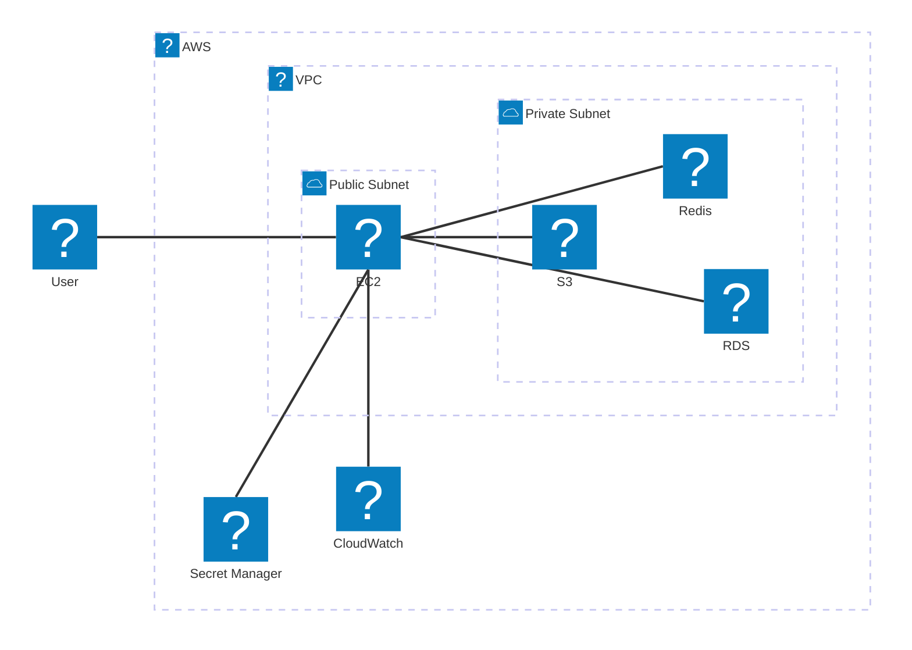

# インフラ設計

## 概要図

### API

```mermaid
architecture-beta
    service user(logos:chrome)[User]

    group aws(logos:aws)[AWS]
    group vpc(logos:aws-vpc)[VPC] in aws
    group public-subnet(cloud)[Public Subnet] in vpc
    group private-subnet(cloud)[Private Subnet] in vpc

    service ec2(logos:aws-ec2)[EC2] in public-subnet

    service rds(logos:aws-rds)[RDS] in private-subnet
    service redis(logos:aws-elasticache)[Redis] in private-subnet

    service s3(logos:aws-s3)[S3] in private-subnet

    service secrets-manager(logos:aws-secrets-manager)[Secret Manager] in aws
    service cloudwatch(logos:aws-cloudwatch)[CloudWatch] in aws

    user:R -- L:ec2

    ec2:R -- L:rds
    ec2:R -- L:redis
    ec2:R -- L:s3

    ec2:B -- T:secrets-manager
    ec2:B -- T:cloudwatch
```

## 各サービス設定

### VPC

### EC2

### RDS

### Redis

### S3

### CloudWatch
