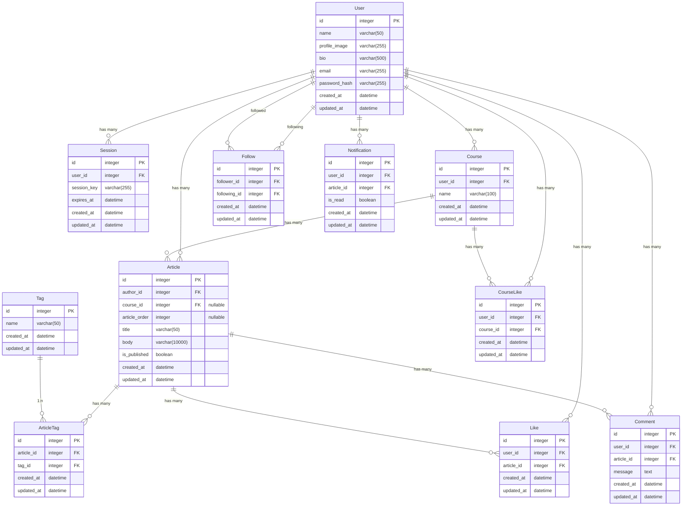

# DB設計

## ER図

## インデックス・制約

### User
- UNIQUE INDEX: `email`

### Tag
- UNIQUE INDEX: `name`

### Article
- INDEX: `author_id` (外部キー制約により自動生成)
- INDEX: `course_id` (外部キー制約により自動生成)
- INDEX: `created_at` (時系列ソート用)
- INDEX: `(is_published, published_at, created_at)` (公開記事の検索最適化用)

### ArticleTag
- UNIQUE INDEX: `(article_id, tag_id)`
- INDEX: `tag_id` (外部キー制約により自動生成)

### Course
- INDEX: `user_id` (外部キー制約により自動生成)
- INDEX: `created_at` (時系列ソート用)

### CourseLike
- UNIQUE INDEX: `(user_id, course_id)`
- INDEX: `course_id` (外部キー制約により自動生成)
- INDEX: `(user_id, created_at)` (ユーザーの講座いいね一覧取得用)

### Like
- UNIQUE INDEX: `(user_id, article_id)`
- INDEX: `article_id` (外部キー制約により自動生成)
- INDEX: `(user_id, created_at)` (ユーザーのいいね記事一覧取得用)

### Comment
- INDEX: `article_id` (外部キー制約により自動生成)
- INDEX: `user_id` (外部キー制約により自動生成)
- INDEX: `(article_id, created_at)` (記事別コメント一覧取得最適化用)

### Follow
- UNIQUE INDEX: `(follower_id, following_id)`
- INDEX: `follower_id` (フォロー中ユーザー検索用)
- INDEX: `following_id` (フォロワー検索用)

### Notification
- INDEX: `user_id` (外部キー制約により自動生成)
- INDEX: `article_id` (外部キー制約により自動生成)
- INDEX: `(user_id, is_read, created_at)` (未読通知取得最適化用)
