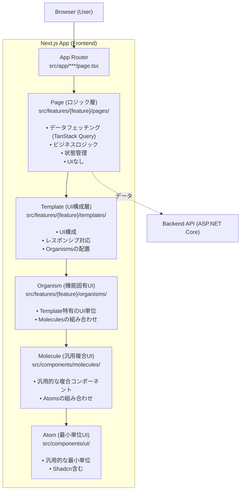
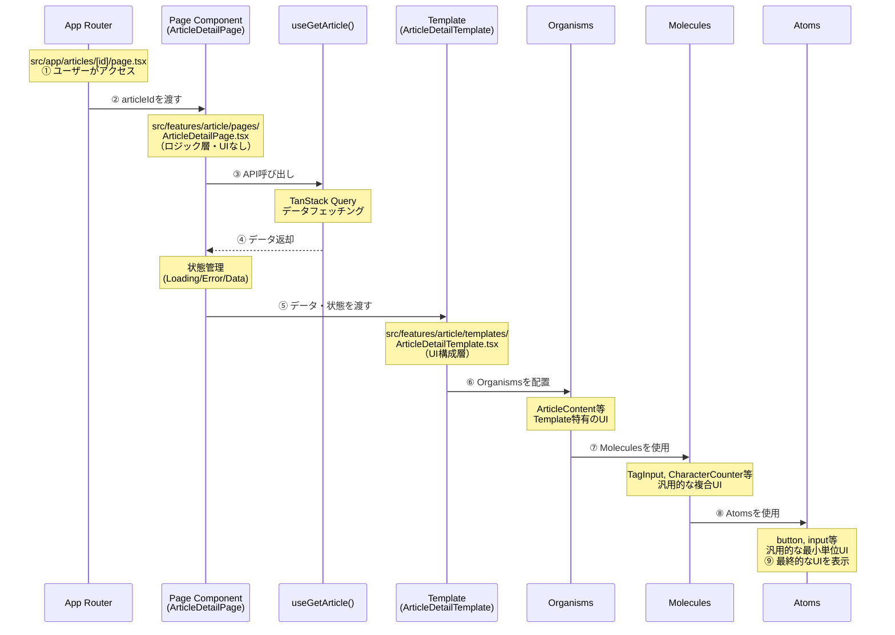
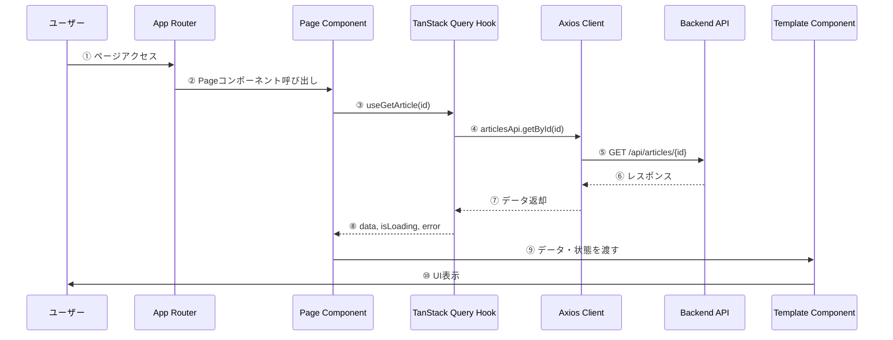
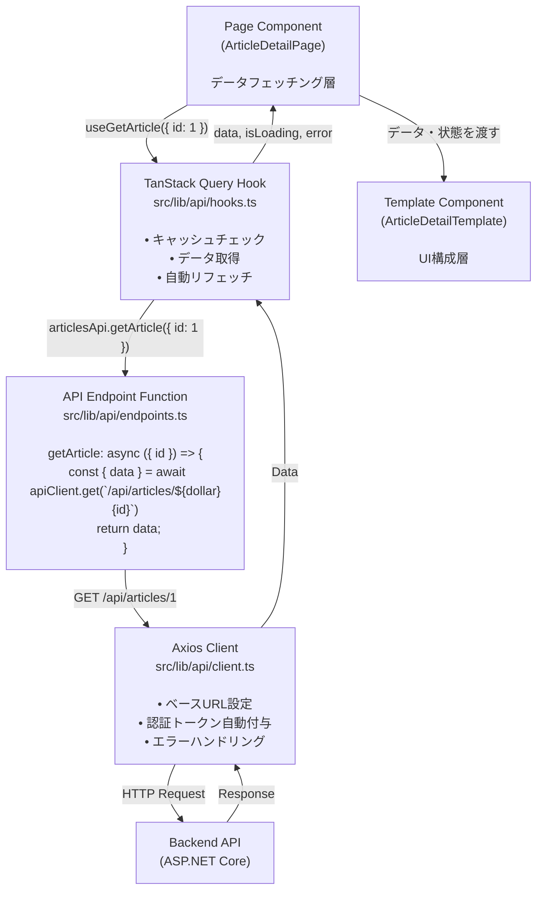
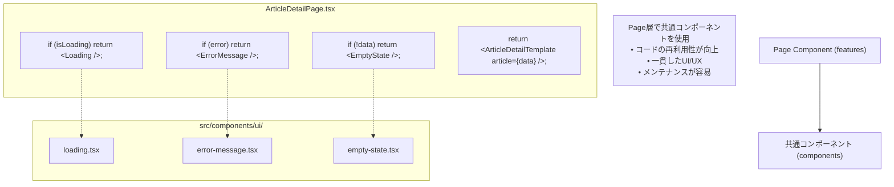
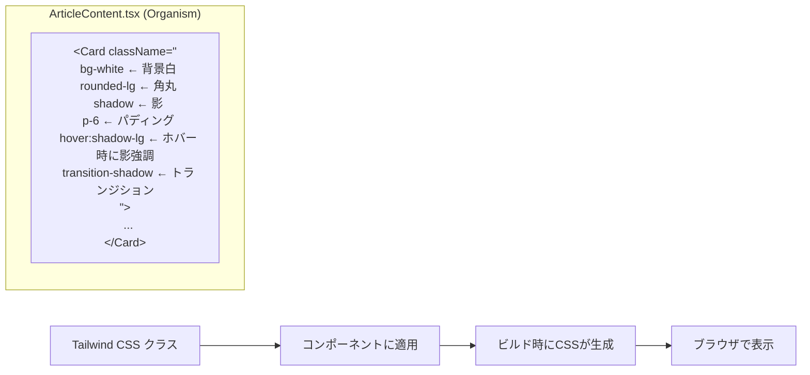
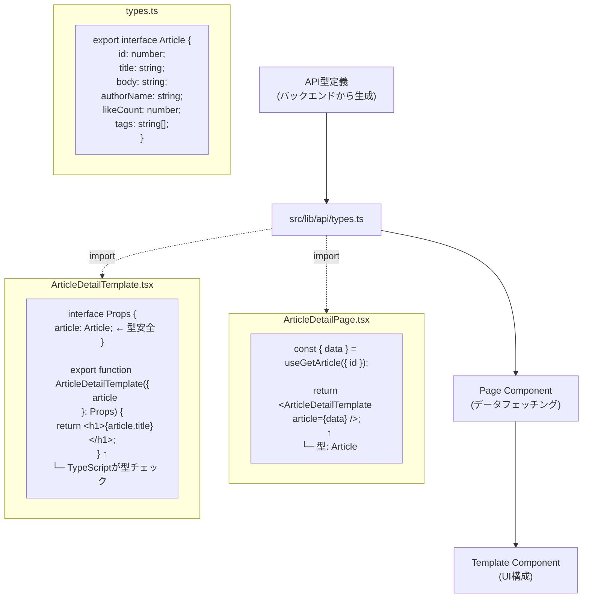

# フロントエンドアーキテクチャ図解

nari-note-frontendのアーキテクチャを図解で説明します。

**このドキュメントは新しい5層Atomic Designパターンに基づいています。**

詳細なアーキテクチャについては [architecture.md](./architecture.md) を参照してください。

## 全体構造（5層Atomic Design）



## ディレクトリ構造とデータフロー

```
src/
│
├── app/                                    # 1️⃣ ユーザーがアクセス
│   ├── articles/
│   │   └── [id]/
│   │       └── page.tsx                   # Next.js App Routerページ
│   │           │
│   │           └─→ 2️⃣ Pageコンポーネントを呼び出し
│
├── features/                               # 機能モジュール
│   ├── article/                            # 記事機能
│   │   ├── pages/                          # 3️⃣ ロジック層（UIなし）
│   │   │   └── ArticleDetailPage.tsx      # データフェッチング + 状態管理
│   │   │       │
│   │   │       ├─→ useGetArticle()         # 4️⃣ API呼び出し
│   │   │       │   (TanStack Query)
│   │   │       │
│   │   │       └─→ 5️⃣ Templateに状態を渡す
│   │   │
│   │   ├── templates/                      # 6️⃣ UI構成層
│   │   │   └── ArticleDetailTemplate.tsx   # レスポンシブUI構成
│   │   │       │
│   │   │       └─→ 7️⃣ Organismsを配置
│   │   │
│   │   ├── organisms/                      # 8️⃣ 機能固有UI層
│   │   │   ├── ArticleContent.tsx          # Template特有のUI単位
│   │   │   ├── ArticleForm.tsx
│   │   │   └── ArticleCard.tsx
│   │   │       │
│   │   │       └─→ 9️⃣ Moleculesを使用
│   │   │
│   │   └── extensions/                     # エディタ拡張（特殊）
│   │       ├── CommandsList.tsx
│   │       └── SlashCommand.tsx
│   │
│   ├── auth/                               # 認証機能
│   │   ├── pages/                          # LoginPage, SignUpPage
│   │   ├── templates/                      # LoginTemplate, SignUpTemplate
│   │   └── organisms/                      # LoginForm, SignUpForm
│   │
│   ├── user/                               # ユーザー機能
│   │   ├── pages/
│   │   ├── templates/
│   │   └── organisms/
│   │
│   ├── tag/                                # タグ機能
│   │   ├── pages/
│   │   ├── templates/
│   │   └── organisms/
│   │
│   └── global/                             # 共通機能
│       └── organisms/                      # Header, Footer等
│           ├── Header.tsx
│           └── Footer.tsx
│
├── components/                             # 汎用コンポーネント
│   ├── molecules/                          # 🔟 汎用複合UI層
│   │   ├── EmailField.tsx                  # 汎用的な複合コンポーネント
│   │   ├── PasswordField.tsx
│   │   ├── TagInput.tsx
│   │   └── CharacterCounter.tsx
│   │       │
│   │       └─→ 1️⃣1️⃣ Atomsを使用
│   │
│   └── ui/                                 # 1️⃣2️⃣ 汎用最小単位UI層
│       ├── button.tsx                      # Shadcn/ui含む
│       ├── input.tsx
│       ├── card.tsx
│       └── ...
│
└── lib/                                    # 共通ロジック
    ├── api/                                # API関連
    │   ├── client.ts                       # Axiosクライアント
    │   ├── hooks.ts                        # TanStack Query フック
    │   └── types.ts                        # 型定義
    ├── utils/                              # ユーティリティ関数
    ├── hooks/                              # 共通カスタムフック
    └── constants/                          # 定数定義
```

## 5層Atomic Designパターン詳細

### データフロー（記事詳細ページの例）



### 5層の階層構造

```
Atoms（原子）- 汎用的な最小単位UI
  ↓ 組み合わせ
Molecules（分子）- 汎用的な複合UI
  ↓ 組み合わせ
Organisms（有機体）- Template特有のUI単位
  ↓ 組み合わせ
Templates（テンプレート）- UI構成・レスポンシブ対応
  ↑ データ受け渡し
Pages（ページ）- ロジック・データフェッチング（UIなし）
  ↑ 呼び出し
App Router - Next.js App Router
```

### 各レイヤーの責務

#### Atoms（`components/ui/`）
- **責務**: 汎用的な最小単位のUIコンポーネント
- **特徴**: 
  - Shadcn/uiを含む
  - 単一の責務を持つ
  - 再利用性が非常に高い
  - ビジネスロジックを持たない
- **例**: `Button`, `Input`, `Card`, `Badge`, `Alert`

#### Molecules（`components/molecules/`）
- **責務**: 汎用的な複合UIコンポーネント
- **特徴**:
  - 複数のAtomsを組み合わせる
  - 特定の機能を持つ
  - 汎用的で複数の機能で再利用可能
  - ビジネスロジックは最小限
- **例**: `EmailField`, `PasswordField`, `TagInput`, `CharacterCounter`

#### Organisms（`features/{feature}/organisms/`）
- **責務**: Template特有のUI単位
- **特徴**:
  - Moleculesを組み合わせて構成
  - Template内で使用される機能固有のUI
  - データはpropsで受け取る（フェッチはしない）
  - 複雑なUIロジックを含むことができる
- **例**: `ArticleContent`, `ArticleForm`, `ArticleCard`, `LoginForm`, `SignUpForm`

#### Templates（`features/{feature}/templates/`）
- **責務**: UI構成とレスポンシブ対応
- **特徴**:
  - Organismsを配置してレイアウト構成
  - レスポンシブデザインの実装
  - データはpropsで受け取る（フェッチはしない）
  - UIの見た目に専念
- **例**: `ArticleDetailTemplate`, `ArticleFormTemplate`, `LoginTemplate`, `HomeTemplate`

#### Pages（`features/{feature}/pages/`）
- **責務**: ロジックとデータフェッチング（UIなし）
- **特徴**:
  - データフェッチング（TanStack Query）
  - ビジネスロジック
  - 状態管理
  - UIは含まない（Templateを呼び出すのみ）
  - バックエンドとの通信を担当
- **例**: `ArticleDetailPage`, `ArticleFormPage`, `LoginPage`, `HomePage`

#### App Router（`app/`）
- **責務**: Next.js App Routerのページコンポーネント
- **特徴**:
  - ルーティングを担当
  - Pagesを呼び出す
  - レイアウトの配置（必要に応じて）
- **例**: `app/articles/[id]/page.tsx`

## API通信フロー



## コンポーネント配置ルール

| 何を作る？ | どこに配置？ | 例 |
|-----------|------------|-----|
| 汎用的な最小単位のUI（Shadcn含む） | `src/components/ui/` | `button.tsx`, `input.tsx`, `card.tsx` |
| 汎用的な複合UIコンポーネント | `src/components/molecules/` | `EmailField.tsx`, `TagInput.tsx` |
| Template特有のUI単位 | `src/features/{feature}/organisms/` | `ArticleContent.tsx`, `ArticleForm.tsx` |
| UI構成・レスポンシブ対応 | `src/features/{feature}/templates/` | `ArticleDetailTemplate.tsx`, `LoginTemplate.tsx` |
| ロジック・データフェッチング | `src/features/{feature}/pages/` | `ArticleDetailPage.tsx`, `LoginPage.tsx` |
| 共通UI（Header等） | `src/features/global/organisms/` | `Header.tsx`, `Footer.tsx` |
| App Routerページ | `src/app/{route}/` | `page.tsx`, `layout.tsx` |

## 実装例

### 記事詳細ページの実装（5層構造）

#### 1. App Router（`app/articles/[id]/page.tsx`）
```tsx
import { ArticleDetailPage } from '@/features/article/pages/ArticleDetailPage';

interface PageProps {
  params: { id: string };
}

export default function ArticleDetailRoute({ params }: PageProps) {
  const articleId = Number(params.id);
  return <ArticleDetailPage articleId={articleId} />;
}
```

#### 2. Page（ロジック層）（`features/article/pages/ArticleDetailPage.tsx`）
```tsx
'use client';

import { useGetArticle } from '@/lib/api';
import { ArticleDetailTemplate } from '@/features/article/templates/ArticleDetailTemplate';
import { Loading } from '@/components/ui/loading';
import { ErrorMessage } from '@/components/ui/error-message';

interface ArticleDetailPageProps {
  articleId: number;
}

export function ArticleDetailPage({ articleId }: ArticleDetailPageProps) {
  // データフェッチング・状態管理（ロジック層）
  const { data, isLoading, error } = useGetArticle({ id: articleId });

  // ローディング・エラーハンドリング
  if (isLoading) return <Loading />;
  if (error) return <ErrorMessage message="記事の取得に失敗しました" />;
  if (!data) return null;

  // Templateにデータを渡す（UIなし）
  return <ArticleDetailTemplate article={data} />;
}
```

#### 3. Template（UI構成層）（`features/article/templates/ArticleDetailTemplate.tsx`）
```tsx
import { ArticleContent } from '@/features/article/organisms/ArticleContent';
import { ArticleMetadata } from '@/features/article/organisms/ArticleMetadata';
import { ArticleActions } from '@/features/article/organisms/ArticleActions';
import type { Article } from '@/lib/api/types';

interface ArticleDetailTemplateProps {
  article: Article;
}

export function ArticleDetailTemplate({ article }: ArticleDetailTemplateProps) {
  return (
    <div className="container mx-auto px-4 py-8">
      <div className="max-w-4xl mx-auto">
        {/* Organismsを配置してUI構成 */}
        <ArticleMetadata 
          author={article.authorName} 
          createdAt={article.createdAt}
          tags={article.tags}
        />
        
        <ArticleContent 
          title={article.title} 
          body={article.body} 
        />
        
        <ArticleActions 
          articleId={article.id}
          likeCount={article.likeCount}
        />
      </div>
    </div>
  );
}
```

#### 4. Organism（機能固有UI）（`features/article/organisms/ArticleContent.tsx`）
```tsx
import { Card, CardContent } from '@/components/ui/card';

interface ArticleContentProps {
  title: string;
  body: string;
}

export function ArticleContent({ title, body }: ArticleContentProps) {
  return (
    <Card className="mb-6">
      <CardContent className="p-6">
        <h1 className="text-3xl font-bold mb-4">{title}</h1>
        <div className="prose prose-lg" dangerouslySetInnerHTML={{ __html: body }} />
      </CardContent>
    </Card>
  );
}
```

#### 5. Molecule（汎用複合UI）（`components/molecules/TagInput.tsx`）
```tsx
import { Input } from '@/components/ui/input';
import { Badge } from '@/components/ui/badge';
import { Button } from '@/components/ui/button';

interface TagInputProps {
  tags: string[];
  onAddTag: (tag: string) => void;
  onRemoveTag: (index: number) => void;
}

export function TagInput({ tags, onAddTag, onRemoveTag }: TagInputProps) {
  return (
    <div className="space-y-2">
      <div className="flex gap-2">
        <Input placeholder="タグを入力" />
        <Button onClick={() => onAddTag('新しいタグ')}>追加</Button>
      </div>
      <div className="flex flex-wrap gap-2">
        {tags.map((tag, i) => (
          <Badge key={i} onClick={() => onRemoveTag(i)}>
            {tag}
          </Badge>
        ))}
      </div>
    </div>
  );
}
```

#### 6. Atom（最小単位UI）（`components/ui/badge.tsx`）
```tsx
// Shadcn/uiのBadgeコンポーネント（最小単位）
export function Badge({ children, ...props }: BadgeProps) {
  return (
    <span className="px-2 py-1 bg-green-100 text-green-800 rounded" {...props}>
      {children}
    </span>
  );
}
```

## まとめ

nari-note-frontendは**5層Atomic Designパターン**を採用し、以下の利点を実現しています：

- ✅ **明確な関心の分離**: Page（ロジック） ← → Template（UI構成） → Organism → Molecule → Atom
- ✅ **ロジックとUIの完全分離**: Pageはロジックのみ、TemplateはUIのみ
- ✅ **高い再利用性**: 小さなコンポーネントを組み合わせて構築
- ✅ **保守性の向上**: 各レイヤーの責務が明確
- ✅ **テスタビリティ**: 小さな単位でテスト可能
- ✅ **スケーラビリティ**: 新機能追加が容易

詳細な実装ガイドは [implementation-guide.md](./implementation-guide.md) を参照してください。

## API通信の詳細フロー



## 機能追加のフロー

### 新機能「コメント機能」を追加する例

```
Step 1: featuresディレクトリ構造作成
───────────────────────────────────
src/features/comment/
├── pages/                     # ロジック層
│   ├── CommentListPage.tsx    # コメント一覧のロジック
│   └── CommentFormPage.tsx    # コメント投稿のロジック
├── templates/                 # UI構成層
│   ├── CommentListTemplate.tsx
│   └── CommentFormTemplate.tsx
└── organisms/                 # 機能固有UI層
    ├── CommentList.tsx
    ├── CommentItem.tsx
    └── CommentForm.tsx


Step 2: API型定義
─────────────────
src/lib/api/types.ts

export interface Comment {
  id: number;
  articleId: number;
  content: string;
  authorName: string;
  createdAt: string;
}


Step 3: API関連実装
──────────────────
src/lib/api/endpoints.ts - エンドポイント定義
src/lib/api/hooks.ts - TanStack Queryフック


Step 4: Atoms/Molecules確認（必要に応じて作成）
─────────────────────────────────────────
src/components/ui/ - 必要なAtomsの確認
src/components/molecules/ - 必要なMoleculesの確認・作成


Step 5: Organisms実装
────────────────────
src/features/comment/organisms/
- CommentItem.tsx - 1件のコメント表示
- CommentList.tsx - コメントリスト表示
- CommentForm.tsx - コメント投稿フォーム


Step 6: Templates実装
────────────────────
src/features/comment/templates/
- CommentListTemplate.tsx - Organismsを配置してUI構成
- CommentFormTemplate.tsx - フォームのUI構成


Step 7: Pages実装
────────────────
src/features/comment/pages/
- CommentListPage.tsx - データフェッチング・状態管理
- CommentFormPage.tsx - フォーム送信ロジック


Step 8: App Routerから使用
─────────────────────────
src/app/articles/[id]/page.tsx

import { ArticleDetailPage } from '@/features/article/pages/ArticleDetailPage';
import { CommentListPage } from '@/features/comment/pages/CommentListPage';

export default function ArticleDetailRoute({ params }: PageProps) {
  const articleId = Number(params.id);
  return (
    <>
      <ArticleDetailPage articleId={articleId} />
      <CommentListPage articleId={articleId} />
    </>
  );
}
```

## 共通コンポーネントの活用



## スタイリングの流れ



## 型安全性の確保



## まとめ

### 5層アーキテクチャの3つの柱

1. **明確な分離**
   - Page（ロジック）とTemplate（UI）の完全分離
   - 機能ごとのモジュール化（features/{feature}/）
   - 汎用コンポーネントの階層化（Molecule → Atom）

2. **型安全性**
   - TypeScriptによる型チェック
   - APIレスポンスの型定義
   - propsの型定義

3. **保守性**
   - 一貫したディレクトリ構造
   - 明確な責務分離
   - 包括的なドキュメント

この5層構造により、開発者もAIも**どこに何を書けば良いかが明確**になります。

## 参考ドキュメント

- [フロントエンドアーキテクチャガイド](./architecture.md)
- [フロントエンド実装ガイド](./implementation-guide.md)
- [クイックリファレンス](./quick-reference.md)
