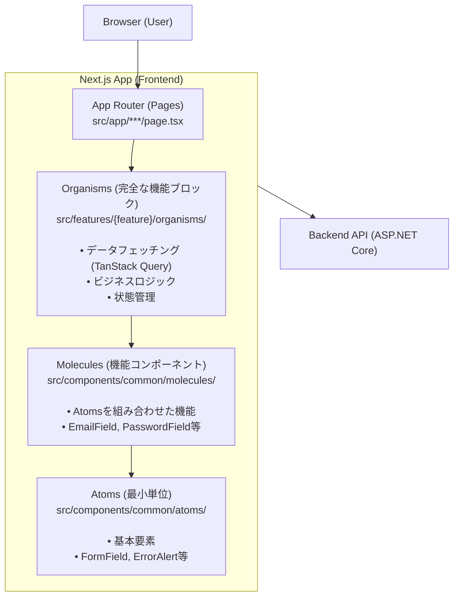
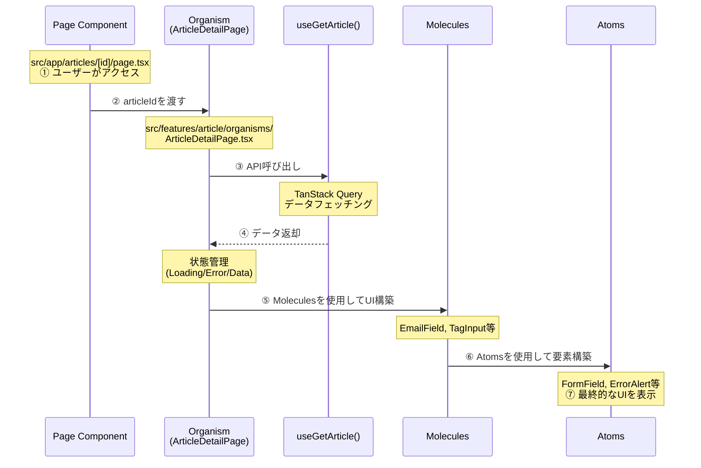
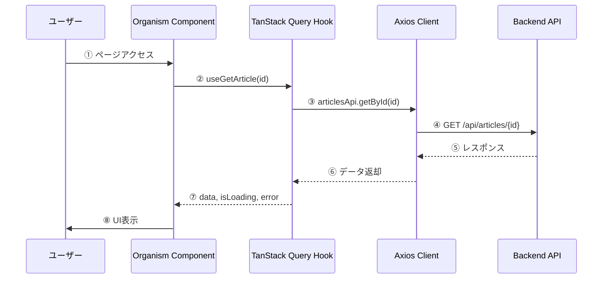
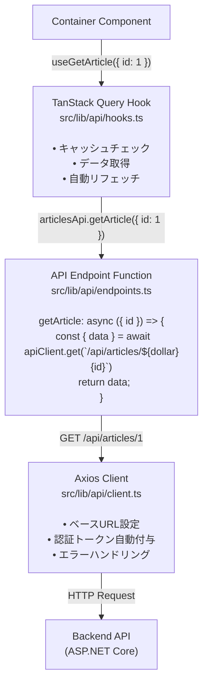
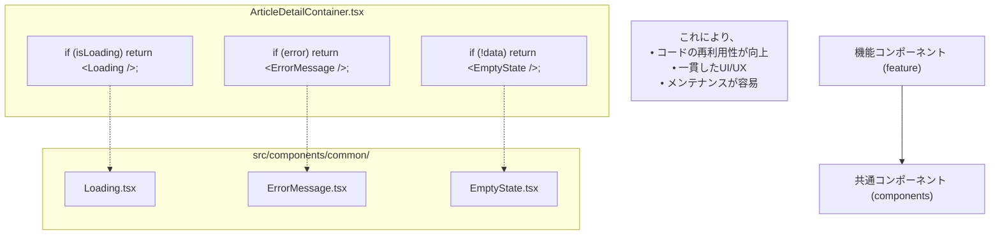
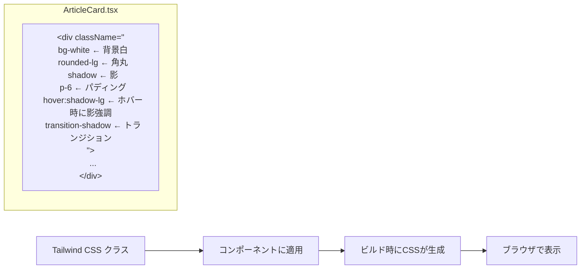
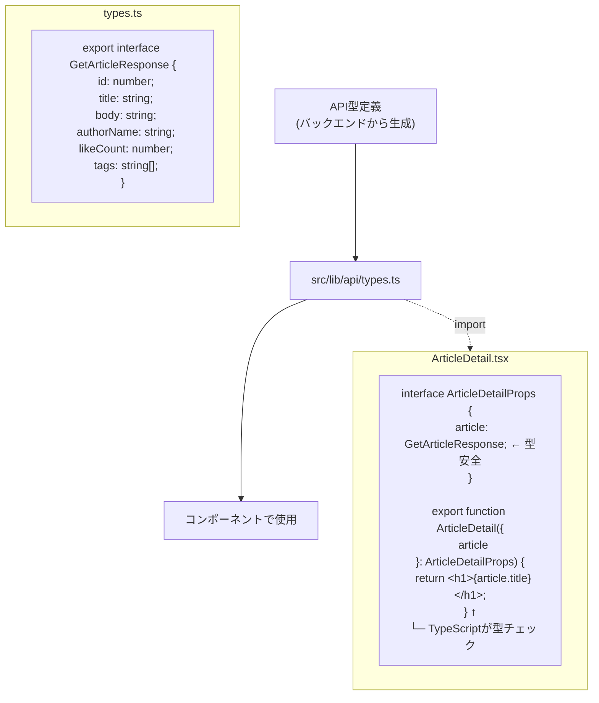

# フロントエンドアーキテクチャ図解

nari-note-frontendのアーキテクチャを図解で説明します。

**このドキュメントは現在のAtomic Designパターンに基づいています。**

詳細なアーキテクチャについては [frontend-architecture.md](./frontend-architecture.md) を参照してください。

## 全体構造（Atomic Design）



## ディレクトリ構造とデータフロー

```
src/
│
├── app/                              # 1️⃣ ユーザーがアクセス
│   ├── articles/
│   │   └── [id]/
│   │       └── page.tsx             # ArticleDetailPage (Next.js)
│   │           │
│   │           └─→ 2️⃣ Organismを呼び出し
│
├── features/                         # 機能モジュール
│   └── article/
│       │
│       ├── organisms/                # 3️⃣ 完全な機能ブロック
│       │   ├── ArticleDetailPage.tsx    # データ取得 + UI構築
│       │   ├── ArticleFormPage.tsx      # 記事作成フォーム
│       │   └── HomeArticleList.tsx      # 記事一覧
│       │       │
│       │       ├─→ useGetArticle()   # 4️⃣ API呼び出し
│       │       │   (TanStack Query)
│       │       │
│       │       └─→ 5️⃣ Molecules/Atomsを使用してUI構築
│       │
│       └── extensions/               # エディタ拡張（特殊）
│           ├── CommandsList.tsx
│           └── SlashCommand.tsx
│
├── components/                       # 共通コンポーネント
│   ├── common/                       # 共通の再利用可能コンポーネント
│   │   ├── atoms/                    # 6️⃣ 最小単位の要素
│   │   │   ├── FormField.tsx
│   │   │   ├── ErrorAlert.tsx
│   │   │   ├── FormTitle.tsx
│   │   │   └── TagChip.tsx
│   │   │
│   │   └── molecules/                # 7️⃣ 機能コンポーネント
│   │       ├── EmailField.tsx        # FormFieldを使用
│   │       ├── PasswordField.tsx
│   │       ├── NameField.tsx
│   │       ├── TagInput.tsx
│   │       └── CharacterCounter.tsx
│   │
│   ├── ui/                           # 基本UIコンポーネント (shadcn/ui)
│   │   ├── button.tsx
│   │   ├── input.tsx
│   │   └── card.tsx
│   │
│   └── layout/                       # レイアウトコンポーネント
│       ├── Header.tsx
│       └── Footer.tsx
│
└── lib/                              # 共通ロジック
    ├── api/                          # API関連
    │   ├── client.ts                 # Axiosクライアント
    │   ├── hooks.ts                  # TanStack Query フック
    │   └── types.ts                  # 型定義
    ├── utils/                        # ユーティリティ関数
    ├── hooks/                        # 共通カスタムフック
    └── constants/                    # 定数定義
```

## Atomic Designパターン詳細

### データフロー（記事詳細ページの例）



### Atomic Designの階層

```
Atoms（原子）- 最小単位の要素
  ↓ 組み合わせ
Molecules（分子）- 機能コンポーネント
  ↓ 組み合わせ
Organisms（有機体）- 完全な機能ブロック
  ↓ 組み合わせ
Pages（ページ）- Next.js App Router
```

### 各レイヤーの責務

#### Atoms（`components/common/atoms/`）
- **責務**: 最小単位の基本要素
- **特徴**: 
  - 単一の責務を持つ
  - 再利用性が高い
  - ビジネスロジックを持たない
- **例**: `FormField`, `ErrorAlert`, `TagChip`, `FormTitle`

#### Molecules（`components/common/molecules/`）
- **責務**: Atomsを組み合わせた機能コンポーネント
- **特徴**:
  - 複数のAtomsを組み合わせる
  - 特定の機能を持つ
  - ビジネスロジックは最小限
- **例**: `EmailField`, `PasswordField`, `TagInput`, `CharacterCounter`

#### Organisms（`features/{feature}/organisms/`）
- **責務**: 完全な機能ブロック
- **特徴**:
  - データフェッチング（TanStack Query）
  - ビジネスロジック
  - 状態管理
  - Molecules/Atomsを組み合わせてUI構築
- **例**: `ArticleDetailPage`, `ArticleFormPage`, `HomeArticleList`, `LoginPage`

#### Pages（`app/`）
- **責務**: Next.js App Routerのページコンポーネント
- **特徴**:
  - ルーティングを担当
  - Organismsを呼び出す
  - レイアウトの配置
- **例**: `app/articles/[id]/page.tsx`

## API通信フロー



## コンポーネント配置ルール

| 何を作る？ | どこに配置？ | 例 |
|-----------|------------|-----|
| 最小単位のコンポーネント | `src/components/common/atoms/` | `FormField.tsx`, `ErrorAlert.tsx` |
| 機能コンポーネント | `src/components/common/molecules/` | `EmailField.tsx`, `TagInput.tsx` |
| 完全な機能ブロック | `src/features/{feature}/organisms/` | `LoginPage.tsx`, `ArticleFormPage.tsx` |
| 基本UIコンポーネント | `src/components/ui/` | `button.tsx`, `input.tsx` |
| レイアウトコンポーネント | `src/components/layout/` | `Header.tsx`, `Footer.tsx` |
| ページコンポーネント | `src/app/{route}/` | `page.tsx` |

## 実装例

### 記事詳細ページの実装

#### 1. Page Component（`app/articles/[id]/page.tsx`）
```tsx
'use client';

import { useParams } from 'next/navigation';
import { ArticleDetailPage } from '@/features/article/organisms/ArticleDetailPage';

export default function ArticleDetailRoute() {
  const params = useParams();
  const articleId = Number(params.id);

  return <ArticleDetailPage articleId={articleId} />;
}
```

#### 2. Organism（`features/article/organisms/ArticleDetailPage.tsx`）
```tsx
'use client';

import { useGetArticle } from '@/lib/api';
import { TagChip } from '@/components/common/atoms/TagChip';
import { ErrorAlert } from '@/components/common/atoms/ErrorAlert';
import { Loading } from '@/components/common/Loading';

export function ArticleDetailPage({ articleId }: { articleId: number }) {
  const { data, isLoading, error } = useGetArticle({ id: articleId });

  if (isLoading) return <Loading />;
  if (error) return <ErrorAlert message="記事の取得に失敗しました" />;
  if (!data) return null;

  return (
    <article>
      <h1>{data.title}</h1>
      <div>{data.body}</div>
      {data.tags?.map((tag, i) => <TagChip key={i} tag={tag} />)}
    </article>
  );
}
```

#### 3. Atom（`components/common/atoms/TagChip.tsx`）
```tsx
export function TagChip({ tag }: { tag: string }) {
  return (
    <span className="px-2 py-1 bg-green-100 text-green-800 rounded">
      {tag}
    </span>
  );
}
```

## まとめ

nari-note-frontendは**Atomic Designパターン**を採用し、以下の利点を実現しています：

- ✅ **明確な関心の分離**: Atoms → Molecules → Organisms → Pages
- ✅ **高い再利用性**: 小さなコンポーネントを組み合わせて構築
- ✅ **保守性の向上**: 各レイヤーの責務が明確
- ✅ **テスタビリティ**: 小さな単位でテスト可能
- ✅ **スケーラビリティ**: 新機能追加が容易

詳細な実装ガイドは [frontend-implementation-guide.md](./frontend-implementation-guide.md) を参照してください。



## 機能追加のフロー

### 新機能「コメント機能」を追加する例

```
Step 1: ディレクトリ作成
───────────────────────
src/features/comment/
├── components/
├── containers/
└── hooks/


Step 2: 型定義（必要に応じて）
─────────────────────────────
src/features/comment/types.ts


Step 3: Presentationalコンポーネント作成
──────────────────────────────────────
src/features/comment/components/
├── CommentList.tsx        # コメント一覧表示
├── CommentItem.tsx        # コメント1件表示
└── CommentForm.tsx        # コメント投稿フォーム


Step 4: Containerコンポーネント作成
──────────────────────────────────
src/features/comment/containers/
├── CommentListContainer.tsx
├── CommentItemContainer.tsx
└── CommentFormContainer.tsx


Step 5: カスタムフック作成（必要に応じて）
──────────────────────────────────────
src/features/comment/hooks/
└── useCommentForm.ts      # フォームロジック


Step 6: ページから使用
─────────────────────
src/app/articles/[id]/page.tsx

import { CommentListContainer } from '@/features/comment/containers/CommentListContainer';

export default function ArticleDetailPage() {
  return (
    <>
      <ArticleDetailContainer articleId={articleId} />
      <CommentListContainer articleId={articleId} />
    </>
  );
}
```

## 共通コンポーネントの活用



## スタイリングの流れ



## 型安全性の確保



## まとめ

### アーキテクチャの3つの柱

1. **明確な分離**
   - Container (データ) と Presentational (UI) の分離
   - 機能ごとのモジュール化 (features/)
   - 共通コンポーネントの再利用

2. **型安全性**
   - TypeScriptによる型チェック
   - APIレスポンスの型定義
   - propsの型定義

3. **保守性**
   - 一貫したディレクトリ構造
   - 明確な命名規則
   - 包括的なドキュメント

この構造により、開発者もAIも**どこに何を書けば良いかが明確**になります。

## 参考ドキュメント

- [フロントエンドアーキテクチャガイド](./frontend-architecture.md)
- [フロントエンド実装ガイド](./frontend-implementation-guide.md)
- [クイックリファレンス](./frontend-quick-reference.md)
